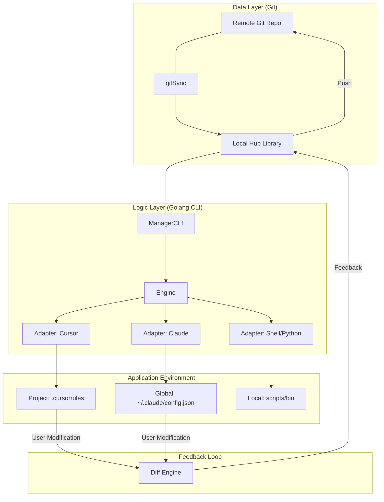

# skill-hub 技术架构与实现方案设计文档 (v1.3)

---

## 1. 项目概述 (Project Vision)

**skill-hub** 是一款专为 AI 时代开发者设计的“技能（Prompt/Script）生命周期管理工具”。它旨在解决 AI 指令碎片化、跨工具同步难、缺乏版本控制等痛点。

*   **核心理念**：Git 为中心（Single Source of Truth），一键分发，闭环反馈。
*   **适用场景**：管理个人常用的 Cursor Rules、Claude Code、OpenCode Skill集，并能从社区（GitHub）发现并集成优质技能。

---

## 2. 系统架构 (System Architecture)

系统由 **Git 仓库（数据层）**、**skill-hub CLI（逻辑层）** 和 **目标工具环境（应用层）** 组成。



---

## 3. 技术选型与合规性 (Tech Stack & Licenses)

| 组件 | 用途 | 许可协议 | 选型理由 |
| :--- | :--- | :--- | :--- |
| **Go 1.24+** | 开发语言 | BSD-style | 原生跨平台、静态编译、执行效率高 |
| **Cobra** | CLI 框架 | Apache 2.0 | 工业级标准，支持复杂的嵌套子命令 |
| **Viper** | 配置管理 | MIT | 灵活支持 YAML/JSON/ENV，适配性强 |
| **go-git** | Git 引擎 | Apache 2.0 | 纯 Go 实现，无需依赖本地系统 Git 二进制 |
| **fsnotify** | 文件监听 | BSD-3-Clause | 跨平台文件系统事件监听 |
| **text/template** | 变量引擎 | Go Stdlib | 标准化、安全且强大的文本渲染 |
| **Survey/Promptui** | 交互式 UI | MIT | 提升反馈环节的用户确认体验 |

---

## 4. 数据规范 (Data Specification)

### 4.1 本地 Skill 仓库结构(~/.skill-hub/)
```text
~/.skill-hub/
├── config.yaml
├── registry.json    # {"version": "1.0.0", "skills": []}
├── state.json
└── repo/
    ├── .git/
    ├── skills/          
    └── templates/       
```

### 4.2 SKILL.md 定义

参见 [Skill Specification](https://agentskills.io/specification)
```markdown
---
name: git-expert
description: 根据变更自动生成符合 Conventional Commits 规范的说明
compatibility: Designed for Cursor and Claude Code (or similar AI coding assistants)
metadata:
  version: 1.2.0
  author: dev-team
  tags: git,workflow
---
# Git 提交专家

根据代码变更自动生成符合 Conventional Commits 规范的提交说明。

## 使用说明
1. 分析代码变更
2. 识别变更类型（feat, fix, docs, style, refactor, test, chore）
3. 生成简洁明了的提交说明

## 变量
- LANGUAGE: {{.LANGUAGE}} - 输出语言

## 示例
当检测到新功能时，生成：
feat: 添加用户登录功能

当修复bug时，生成：
fix: 修复登录页面样式错位问题
```

**注意**：
- `compatibility`字段应为字符串格式，描述技能适用的AI工具
- 支持的目标工具：`cursor`, `claude_code`, `open_code`
- 示例：`Designed for Cursor and Claude Code (or similar AI coding assistants)`
- 旧的对象格式（如 `compatibility: { cursor: true, claude_code: false }`）会被视为警告

---

## 5. 源代码项目结构 (Standard Go Layout)

```text
skill-hub/
├── cmd/
│   └── skill-hub/          # 程序唯一入口
│       └── main.go
├── internal/               # 私有逻辑，禁止外部引用
│   ├── adapter/            # 各工具适配器 (实现写入与提取逻辑)
│   │   ├── adapter.go      # 统一接口定义
│   │   ├── cursor.go       # .cursorrules 适配
│   │   └── claude.go       # Claude config.json 适配
│   ├── cli/                # Cobra 指令定义 (init, apply, sync...)
│   ├── config/             # 管理器自身全局配置 (~/.skill-hub/config.yaml)
│   ├── engine/             # 核心引擎 (正则解析、模板渲染、Diff 算法)
│   ├── git/                # 封装 go-git 操作逻辑
│   ├── state/              # 记录本地项目与技能的关联状态 (state.json)
│   └── ui/                 # 封装终端交互、进度条、Diff 展示
├── pkg/                    # 可被外部引用的公共定义
│   └── spec/               # Skill 规范的 Go Struct 定义
├── go.mod
└── README.md
```

---

## 6. 核心工程逻辑实现 (Engineering Details)

### 6.1 标记块技术 (The Marker Technique)
为了实现非侵入式修改，在写入目标文件时使用特定的标记。
*   **正则表达式**: 
    `(?s)# === SKILL-HUB BEGIN: (?P<id>.*?) ===\n(?P<content>.*?)\n# === SKILL-HUB END: \1 ===`
*   **逻辑**: 工具仅修改标记对之间的内容。用户在标记对之外手写的任何内容（如项目特有的 Rules）都会被完整保留。

### 6.2 反馈闭环算法 (Feedback Logic)
1.  **扫描**: `status` 命令读取项目配置文件，通过正则定位所有 `BEGIN` 块。
2.  **提取**: 提取块内当前文本 $T_{current}$。
3.  **对比**: 将 $T_{current}$ 与仓库中原始模板通过变量渲染后的文本 $T_{repo}$ 进行哈希对比。
4.  **同步**: 若不一致，调用 `feedback` 指令。工具会通过 `diff` 库展示差异，确认后将改动回写至仓库的 `SKILL.md`。

### 6.3 变量注入过程
在执行 `apply` 时：
1. 从 `state.json` 加载该项目的变量配置（如 `LANGUAGE=en`）。
2. 使用 `text/template` 将 `SKILL.md` 进行预渲染。
3. 将渲染后的纯文本写入标记块。

---

## 7. CLI 指令设计 (User Experience)

| 命令 | 示例 | 详细行为 |
| :--- | :--- | :--- |
| `init` | `skill-hub init [git_url] [--target <value>]` | 创建 `~/.skill-hub`，初始化全局配置。如提供了git_url参数，则克隆远程仓库；否则仅进行本地管理。 |
| `set-target` | `skill-hub set-target <value>` | 设置当前项目的首选目标环境，持久化到 `state.json` 中。 |
| `list` | `skill-hub list [--target <value>] [--verbose]` | 展示本地库中所有 Skill 状态、版本和适用工具，支持按目标环境过滤。 |
| `search` | `skill-hub search <keyword> [--target <value>] [--limit <number>]` | 搜索远程技能，支持按目标环境过滤和结果数量限制。 |
| `create` | `skill-hub create <id> [--target <value>]` | 在项目工作区创建一个新技能模板，仅存在于项目本地。 |
| `remove` | `skill-hub remove <id>` | 从当前项目工作区中移除指定的技能，物理删除项目工作区对应的文件/配置。 |
| `validate` | `skill-hub validate <id>` | 验证指定技能的项目工作区的文件是否合规。 |
| `use` | `skill-hub use <id> [--target <value>]` | 将技能标记为在当前项目中使用，仅更新 `state.json` 中的状态记录。 |
| `status` | `skill-hub status [id] [--verbose]` | **监测**：对比项目本地工作区文件与技能仓库源文件的差异，显示技能状态。 |
| `apply` | `skill-hub apply [--dry-run] [--force]` | **分发**：根据 `state.json` 中的启用记录和目标环境设置，将技能物理分发到项目工作区。 |
| `feedback`| `skill-hub feedback <id> [--dry-run] [--force]` | **回收**：将项目工作区的指定技能修改同步回本地技能仓库。 |
| `pull` | `skill-hub pull [--force] [--check]` | 从远程技能仓库拉取最新更改到本地仓库，并更新技能注册表。 |
| `push` | `skill-hub push [--message MESSAGE] [--force] [--dry-run]` | 自动检测并提交所有未提交的更改，然后推送到远程技能仓库。 |
| `git` | `skill-hub git <subcommand>` | 提供底层Git仓库操作接口，适用于需要精细控制Git工作流的用户。 |

---

## 8. 安全与健壮性设计 (Safety)

*   **路径保护**: 预设 Claude 和 Cursor 的默认路径（如 `~/Library/Application Support/...`），但允许通过环境变量覆盖。
*   **原子写入**: 所有修改先写入 `.tmp` 文件，校验成功后再 `os.Rename`，防止断电导致配置丢失。
*   **自动备份**: 修改任何现有配置文件前，自动创建 `.bak` 时间戳备份。
*   **权限审计**: 当从 GitHub 下载包含脚本（`scripts/`）的技能时，安装前强制提示用户审计代码。
*   **错误码规范**:
    *   `ERR_GIT_AUTH`: Git 认证失败。
    *   `ERR_MARKER_NOT_FOUND`: 在反馈时无法找到标记行。
    *   `ERR_TEMPLATE_PARSE`: Prompt 模板语法错误。

---

## 9. 开发者路线图 (Roadmap)

1.  **里程碑 1 (基础)**: 完成基于 Go + Cobra 的 `init`, `list`, `apply` (Cursor 适配)。实现基础 Git 同步。
2.  **里程碑 2 (闭环)**: 实现正则解析引擎，支持 `status` 差异检测与 `feedback` 改动回收。
3.  **里程碑 3 (多端)**: 增加 Claude Code 全局 JSON 配置适配器，实现变量注入功能。
4.  **里程碑 4 (生态)**: 实现 GitHub Search 搜索导入，增加终端 Diff 展示 UI。

---

## 10. 结论

**skill-hub** 通过 Golang 的工程化优势，构建了一个“**Git 存储 -> CLI 路由 -> 工具端应用 -> 实际反馈 -> Git 回传**”的完整闭环。它不仅是一个管理工具，更是 AI 开发者持续优化自身 Prompt 资产的底层基础设施。