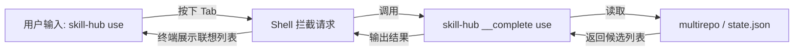

# Skill Hub 专项设计文档：自动联想与补全系统 (v1.0)

## 1. 设计目标
*   **命令补全**：自动补全基础命令（如 `apply`, `feedback`）及选项（Flags）。
*   **动态数据补全**：根据本地多仓库技能元数据与 `state.json` 实时联想 **Skill ID** 和 **Repo 名称**；当前实现优先读取各 repo 下的 `registry.json`，失败时回退到仓库扫描。
*   **状态自修复配合**：当 `state.json` 因项目目录迁移、删除出现脏数据时，可通过 `skill-hub prune` 清理失效项目记录，恢复补全结果准确性。
*   **多 Shell 支持**：兼容 Bash, Zsh, Fish, PowerShell。
*   **零延迟体验**：联想逻辑必须在 50ms 内响应，不影响终端输入流。

---

## 2. 技术实现方案

### 2.1 基础框架：Cobra Completion
利用 Cobra 内置的补全生成器。工具将提供一个 `completion` 命令，用于生成对应 Shell 的配置脚本。
*   **实现原理**：当用户按下 `Tab` 键时，Shell 会调用 `skill-hub` 的隐藏补全接口，获取候选列表。

### 2.2 动态联想逻辑 (Dynamic Completion)
通过 Cobra 的 `ValidArgsFunction` 或 `RegisterFlagCompletionFunc` 接口，在运行时读取本地状态。

#### A. 技能 ID 联想 (Skill ID Completion)
*   **适用命令**：`use`, `feedback`, `remove`, `validate`
*   **联想源**：多仓库下以各 repo 的 `registry.json` 为主（通过 `multirepo.Manager.ListSkills` 读取），索引不存在或解析失败时回退到 `skills` 目录扫描；同时配合进程内短 TTL 缓存以保障 50ms 内响应。
*   **上下文过滤**：
    *   对于 `use`：显示所有已启用仓库中的 Skill（支持 `repo/id` 命名空间模式）。
    *   对于 `feedback` / `remove` / `validate`：仅显示当前项目 `state.json` 中已启用的 Skill。

#### B. 仓库联想 (Repo Completion)
*   **适用命令**：`repo` 相关子命令，或 `use [repo]/[id]`
*   **联想源**：`~/.skill-hub/config.yaml` 中 `multi_repo.repositories` 的 key（仓库名称），以及默认仓库（primary）。

---

## 3. 核心功能设计细则

### 3.1 技能 ID 智能匹配逻辑
为了支持多 Repo 下的技能补全，补全引擎需遵循以下逻辑：
1.  **简单模式**：若用户输入 `skill-hub use [Tab]`，显示所有 `skill-id`。
2.  **命名空间模式**：若用户输入 `skill-hub use community/[Tab]`，则仅联想 `community` 仓库下的技能。
3.  **状态感知补全**：
    *   输入 `skill-hub remove [Tab]` 时，代码逻辑如下：
        ```go
        // 伪代码：只从当前项目 state.json 提取启用的 ID
        enabledSkills := state.GetCurrentProjectEnabledSkills()
        return enabledSkills, cobra.ShellCompDirectiveNoFileComp
        ```

### 3.2 联想触发流


---

## 4. CLI 指令与交互设计

### 4.1 安装补全脚本
用户只需运行一次安装命令即可开启联想：

**Bash**
```bash
mkdir -p ~/.local/share/bash-completion/completions
skill-hub completion bash > ~/.local/share/bash-completion/completions/skill-hub
```
若按 Tab 仍为文件补全（未出现子命令），需在 `~/.bashrc` 末尾显式加载：
```bash
# skill-hub 补全（若系统未自动加载该目录）
[[ -f ~/.local/share/bash-completion/completions/skill-hub ]] && source ~/.local/share/bash-completion/completions/skill-hub
```
然后执行 `source ~/.bashrc` 或新开终端。

**Zsh**: `skill-hub completion zsh > /usr/local/share/zsh/site-functions/_skill-hub`（或放入 `$fpath` 下目录）
**系统级 Bash**（需 sudo）: `skill-hub completion bash > /etc/bash_completion.d/skill-hub`

### 4.2 联想效果示例
*   **场景 1 (命令)**:
    输入 `skill-hub fe[Tab]` -> 自动补全为 `skill-hub feedback `。
*   **场景 2 (动态 ID)**:
    输入 `skill-hub remove [Tab]` -> 终端列出：`git-expert`, `py-cleaner` (仅当前项目启用的)。
*   **场景 3 (Repo 值)**:
    输入 `skill-hub repo sync [Tab]` -> 终端列出已配置的仓库名称。

---

## 5. 开发任务清单 (Backlog)

*   [ ] **启用 Cobra 默认 completion 子命令**：将根命令的 `CompletionOptions.DisableDefaultCmd` 设为 `false`，使用户可执行 `skill-hub completion bash|zsh|fish|powershell`。
*   [ ] **配置 Cobra 命令树**：确保所有命令都定义了正确的 `Args` 限制。
*   [x] **实现补全模块**：`internal/cli/completer.go` 已基于 `multirepo.ListSkills` 提供 Skill ID、当前项目已启用 ID、Repo 名称等补全函数。
*   [ ] **集成状态感知**：在 `remove`、`feedback`、`validate` 命令中接入基于 `state.json` 当前项目的动态过滤。
*   [x] **测试联想性能**：当前实现已优先使用 repo 级 registry，并增加 5 秒进程内短 TTL 缓存；后续仍可继续补专项性能基准。

### 5.1 性能策略
*   当前实现已优先读取 repo 级 `registry.json`，并对 `ListSkills` 结果做 5 秒进程内短 TTL 缓存。
*   若后续典型规模下仍超时，可进一步降级为仅扫描默认 repo 或返回空列表，避免阻塞 Shell。

---

## 6. 验收准则 (Acceptance Criteria)

| 编号 | 验收项 | 验收指标 (Expectation) |
| :--- | :--- | :--- |
| **18.1** | **静态补全** | 在 Zsh/Bash 下，输入 `skill-hub` 后按两下 `Tab` 必须列出所有 Available Commands。 |
| **18.2** | **动态 ID 补全** | 执行 `skill-hub use` 时，补全列表必须包含所有已添加 Repo 里的 Skill ID。 |
| **18.3** | **上下文过滤补全** | 在已启用 A 技能的项目中，执行 `skill-hub remove` 补全列表应包含 A，且不包含未启用的 B。 |
| **18.4** | **Repo 补全** | 输入仓库相关命令位置参数后，应提示已配置仓库名称。 |
| **18.5** | **联想速度** | 按下 `Tab` 到候选列表出现，感知延迟应小于 0.1 秒。 |
| **18.6** | **失效状态收敛** | 当补全结果受失效项目状态干扰时，执行 `skill-hub prune` 后，基于 `state.json` 的上下文补全应恢复准确。 |

---

## 7. 总结
本设计通过对 Cobra 补全机制的二次开发，将 **Skill Hub** 内部的元数据（Registry 和 State）暴露给终端 Shell。这极大地降低了用户记忆长 Skill ID 或复杂路径的需求，使工具的操作流更加连贯、专业。
